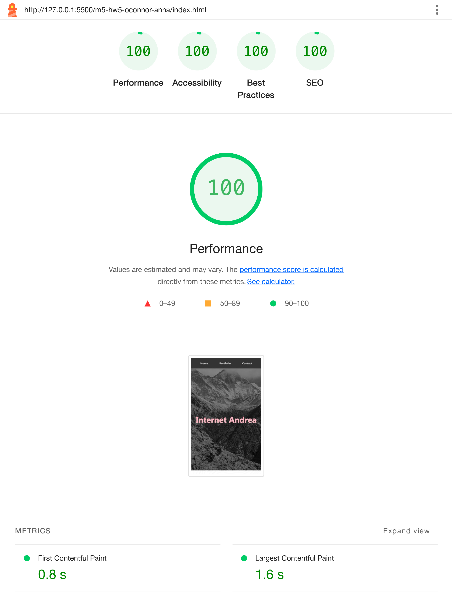
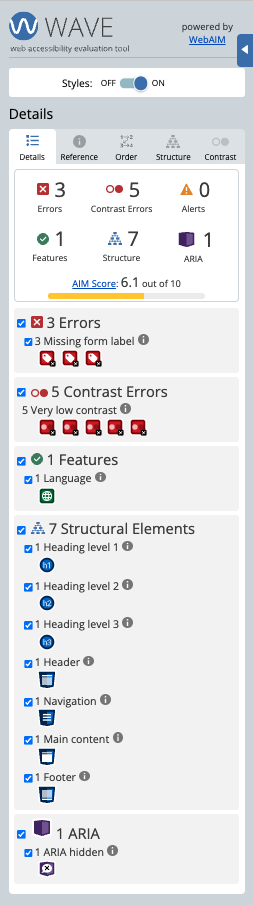
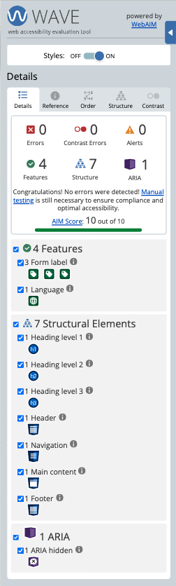
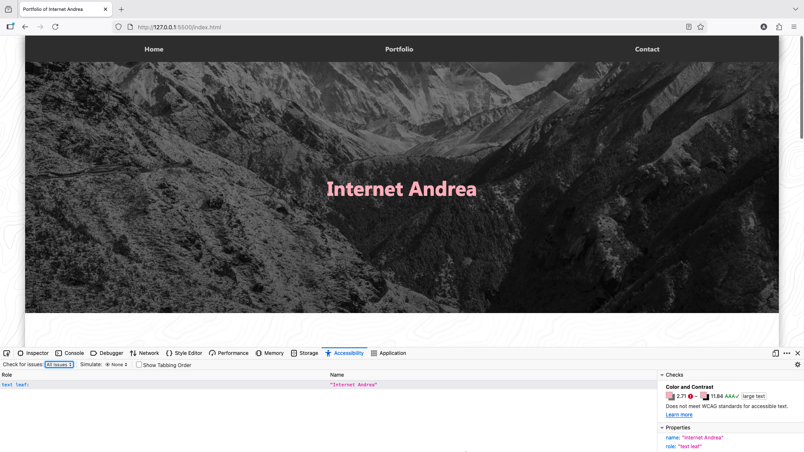

# Auditing for A11y

## PART 1: Lighthouse Audit

### Initial Lighthouse Audit Results

### Hero Image Optimization
1. Converted `mountains.jpg` to `mountains.webp` to serve a next-generation image format using Squoosh.
2. Added `<link rel="preload" as="image" href="mountains.webp">` to improve Largest Contentful Paint.
3. Added `linear-gradient` to `mountains.webp` (aka the `background-image`) to improve readability of text

### SVG Compression
1. Compressed `topography.svg` using svomg.
2. Saved as `topography-compressed.svg` to not confuse it for the original image, and updated the CSS styling to match the name change where needed.

### Render & Extension Accuracy Issues
Re-ran Lighthouse in Incognito mode to remove Grammarly extension scripts that artificially inflated JavaScript execution time.

### Heading Hierarchy
Corrected heading order from `h1`→`h3` to `h1`→`h2`→`h3`

### Color Contrast

#### Nav Bar

1. Updated navigation link color from `#555555` to `#cccccc`
2. Added hover state color `#eeeeee` and `text-decoration: underline;`

#### Form Heading
Changed from `#999999` to `#4d4d4d`

#### Footer 
1. Updated with same contrast fix as header
2. Alternate icon method to change its color contrast too

### Button Accessibility
1. Replaced `
` with a semantic `<button type="submit">`.
2. Added `width: 100%;`
3. Gave it `hover` and `focus` states

### Meta Description
Added `<meta name="description">` inside `<head>` to improve SEO score.

### Semantic HTML Updates
1. Changed `
` to `<nav>`
2. Changed `
` to `<header class="hero">`
3. Changed `
` to `<footer class="footer">`
4. Changed `
` to `<main class="content">`
5. Changed `
` to `<section class="form-section">`

### Lighthouse Audit After Changes 

## PART 2: WAVE Audit

### Initial WAVE Audit Results

### Missing Form Labels
1. Added `<label>` elements for Name, Email, and Message.
2. Connected labels with matching `for` and `id` attributes.

### Fixing Contrast (Wave Results)
Changed `body` color from `#999999` to `#575757`

### WAVE Audit After Changes

## PART 3: Firefox Accessibility Checker

## Initial Firefox Audit Results

### Revisiting Hero Section Contrast
Increased `background-image` `linear-gradient` overlay from `0.45`–`0.55` to `0.55`–`0.6`.

## PART 4: Final Pass
1. Changed hero section from a `<header>` to a `<section>`
2. Wrapped `<nav>` in a `<header>`
3. Changed the form's `<h3>` to `<h2>` for structural consistency
4. Added  `:focus` styles to nav links, and added destinations for Home and Contact
5. Removed `outline:none;` from button
6. Changed hero section's text pink from `#ffb6c1` to `#ffc5cd`
